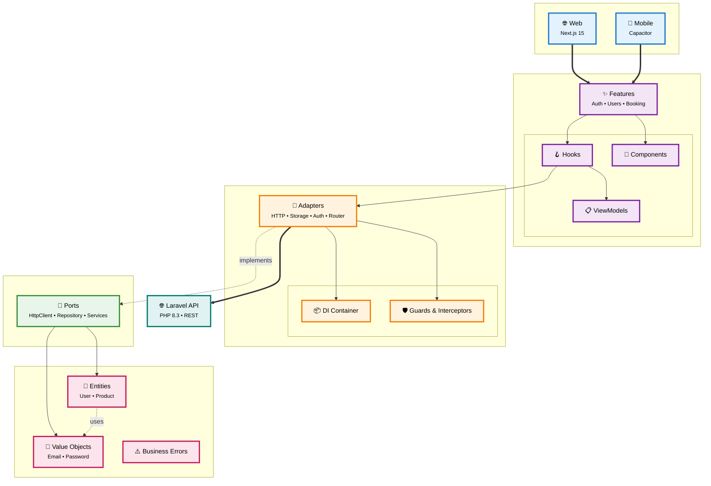

# Kennelo

**Plateforme de réservation de services pour animaux** - Architecture Clean, Monorepo TypeScript/PHP

[](LICENSE)
[](https://nodejs.org)
[](https://php.net)
[](https://pnpm.io)

---

## 📋 Table des Matières

- [Vue d'ensemble](#-vue-densemble)
- [Architecture](#-architecture)
- [Structure du Projet](#-structure-du-projet)
- [Technologies](#-technologies)
- [Quick Start](#-quick-start)
- [Développement](#-développement)
- [Bonnes Pratiques](#-bonnes-pratiques)
- [Documentation Détaillée](#-documentation-détaillée)
- [Scripts Disponibles](#-scripts-disponibles)

---

## 🎯 Vue d'ensemble

Kennelo est une plateforme moderne permettant de gérer des réservations de services pour animaux (pensions, vétérinaires, toilettage). Le projet utilise une **architecture Clean** avec un monorepo TypeScript/PHP pour partager la logique métier entre web et mobile.

### Caractéristiques Principales

- 🏗️ **Clean Architecture** - Séparation stricte des couches (Domain, Application, Infrastructure, Presentation)
- 📦 **Monorepo** - Code partagé entre applications web et mobile
- 🌍 **Multilingue** - Support FR, EN, DE, IT
- 🔐 **Authentification JWT** - Tokens access/refresh avec guards et interceptors
- 📱 **Cross-platform** - Web (Next.js) + Mobile (Capacitor iOS/Android)
- 🎨 **Design System** - Radix UI + Tailwind CSS + shadcn/ui
- 🧪 **Type-safe** - TypeScript strict sur tout le frontend

---

## 🏗️ Architecture

### Diagramme de Flux



### Principes de Dépendances

```
Domain          ──> (aucune dépendance)
Application     ──> Domain
Infrastructure  ──> Application + Domain
Presentation    ──> Application + Domain + Infrastructure (via DI)
Apps (web/mobile) ──> Presentation + Infrastructure (configuration)
```

**Règle d'or** : Les dépendances vont **toujours vers l'intérieur** (vers le Domain).

---

## 📂 Structure du Projet

```
kennelo/
├── api/                        # Backend Laravel (PHP 8.3)
│   ├── app/
│   │   ├── Models/            # Eloquent Models
│   │   ├── Http/Controllers/  # API Controllers
│   │   ├── Services/          # Business Services
│   │   └── Enums/             # PHP Enums
│   ├── routes/api.php         # API Routes
│   └── database/migrations/   # DB Migrations
│
├── apps/
│   ├── web/                   # Application Next.js
│   │   ├── src/
│   │   │   ├── app/           # App Router (Next.js 15)
│   │   │   ├── config/        # Container DI configuration
│   │   │   ├── adapters/      # Next.js specific adapters
│   │   │   └── providers/     # React Providers
│   │   └── next.config.mjs
│   │
│   └── mobile/                # Application Capacitor
│       ├── src/               # Code React (partagé avec web)
│       ├── capacitor.config.ts
│       └── ios/android/       # Projets natifs
│
└── packages/                  # Code partagé (Clean Architecture)
    ├── domain/                # 🎯 Logique métier pure
    │   ├── entities/          # UserEntity, CategoryEntity
    │   ├── values/            # Email, Password
    │   └── errors/            # Business Errors
    │
    ├── application/           # 🔌 Ports (interfaces)
    │   └── ports/
    │       ├── http/          # HttpClient, Interceptor
    │       ├── repositories/  # Repository interfaces
    │       ├── routing/       # Router, RouteGuard
    │       └── services/      # AuthService, StorageService
    │
    ├── infrastructure/        # 🛠️ Implémentations
    │   ├── adapters/
    │   │   ├── http/          # FetchClient, AxiosClient
    │   │   ├── repositories/  # ApiUserRepository
    │   │   └── services/      # ApiAuthService, LocalStorageService
    │   └── di/                # Container DI + Tokens
    │
    ├── presentation/          # 🎨 UI & Composants React
    │   ├── features/          # Features métier (vertical slices)
    │   │   ├── auth/          # Feature authentification
    │   │   ├── users/         # Feature gestion users
    │   │   └── booking/       # Feature réservations
    │   └── shared/            # Code UI partagé
    │       ├── components/    # Composants génériques
    │       ├── hooks/         # Hooks partagés (useRepository)
    │       └── contexts/      # React Contexts (DI)
    │
    └── translations/          # Traductions i18n (fr, en, de, it)
```

---

## 🛠️ Technologies

### Frontend

| Couche        | Technologies                        |
| ------------- | ----------------------------------- |
| **Framework** | Next.js 15 (Turbopack), React 19    |
| **Language**  | TypeScript (strict mode)            |
| **UI**        | Radix UI, Tailwind CSS 4, shadcn/ui |
| **Forms**     | React Hook Form + Zod               |
| **Mobile**    | Capacitor 6 (iOS/Android)           |
| **HTTP**      | Fetch API (custom client)           |
| **State**     | React Hooks + Custom DI             |

### Backend

| Couche          | Technologies           |
| --------------- | ---------------------- |
| **Framework**   | Laravel 12             |
| **Language**    | PHP 8.3                |
| **Auth**        | JWT (firebase/php-jwt) |
| **Database**    | MySQL/PostgreSQL       |
| **Validation**  | Spatie Laravel Data    |
| **Permissions** | Spatie Permission      |
| **Tests**       | Pest PHP               |

### DevOps

- **Monorepo** : pnpm workspaces
- **Linting** : ESLint + PHP_CodeSniffer
- **Type Check** : TypeScript + PHPStan
- **Git Hooks** : Husky (pre-commit)

---

## 🚀 Quick Start

### Prérequis

```bash
# Node.js >= 18
node --version

# pnpm >= 9
pnpm --version

# PHP >= 8.3
php --version

# Composer
composer --version
```

### Installation

```bash
# 1. Cloner le repository
git clone <repo-url>
cd kennelo

# 2. Installer les dépendances frontend
pnpm install

# 3. Installer les dépendances backend
cd api
composer install

# 4. Configuration environnement
cp api/.env.example api/.env
php artisan key:generate
php artisan jwt:secret

# 5. Migrations base de données
php artisan migrate --seed

# 6. Lancer l'API (terminal 1)
cd api
php artisan serve

# 7. Lancer le frontend web (terminal 2)
cd ..
pnpm dev

# 8. Lancer le mobile (optionnel)
pnpm dev:mobile
```

### URLs

- **Web** : http://localhost:3000
- **Mobile** : http://localhost:3001
- **API** : http://localhost:8000

---

## 💻 Développement

### Workflow de Développement

#### 1. Créer une Nouvelle Feature

```bash
# Structure à créer
packages/presentation/features/ma-feature/
├── core/
│   └── view-models/
│       └── ma-feature.view-model.ts
└── react/
    ├── hooks/
    │   └── use-ma-feature.tsx
    └── views/
        └── ma-feature.view.tsx
```

#### 2. Définir l'Entité (Domain)

```typescript
// packages/domain/entities/ma-feature.entity.ts
export class MaFeatureEntity {
  private constructor(public uuid: string, public name: string) {}

  static from(data: { uuid: string; name: string }) {
    return new MaFeatureEntity(data.uuid, data.name);
  }
}
```

#### 3. Définir le Port (Application)

```typescript
// packages/application/ports/repositories/ma-feature-repository.interface.ts
export interface MaFeatureRepository extends BaseRepository<MaFeatureEntity> {
  findByName(name: string): Promise<MaFeatureEntity | undefined>;
}
```

#### 4. Implémenter l'Adapter (Infrastructure)

```typescript
// packages/infrastructure/adapters/repositories/api-ma-feature.repository.ts
export class ApiMaFeatureRepository
  extends BaseApiRepository<MaFeatureEntity>
  implements MaFeatureRepository
{
  constructor(httpClient: HttpClient) {
    super(httpClient, "/ma-feature");
  }

  protected toDomain(dto: any): MaFeatureEntity {
    return MaFeatureEntity.from({
      uuid: dto.id,
      name: dto.name,
    });
  }
}
```

#### 5. Créer le Hook (Presentation)

```typescript
// packages/presentation/features/ma-feature/react/hooks/use-ma-feature.tsx
export function useMaFeature() {
  const repository = useRepository(ApiMaFeatureRepository, [
    DI_TOKENS.HttpClient,
  ]);
  const { execute, isLoading, error } = useAsyncState();

  const findAll = async () => {
    return await execute(() => repository.findAll());
  };

  return { findAll, isLoading, error };
}
```

#### 6. Utiliser dans un Composant

```typescript
// packages/presentation/features/ma-feature/react/views/home.view.tsx
export default function MaFeatureHomeView() {
  const { findAll, isLoading } = useMaFeature();
  const [items, setItems] = useState([]);

  useEffect(() => {
    findAll().then(setItems);
  }, []);

  return (<div>{/* UI */}</div>);
}

// apps/web/src/app/ma-feature/page.tsx
export default function Page() {
  return <MaFeatureHomeView />;
}
```

### Convention de Nommage

| Type             | Convention                    | Exemple                    |
| ---------------- | ----------------------------- | -------------------------- |
| **Entité**       | `*.entity.ts`                 | `user.entity.ts`           |
| **Value Object** | `*.value.ts`                  | `email.value.ts`           |
| **Interface**    | `*.interface.ts`              | `http-client.interface.ts` |
| **Adapter**      | `*-client.ts`, `*.service.ts` | `fetch-client.ts`          |
| **Hook**         | `use-*.tsx`                   | `use-auth.tsx`             |
| **ViewModel**    | `*.view-model.ts`             | `user.view-model.ts`       |
| **Component**    | `*.tsx`                       | `button.tsx`               |

---

## ✅ Bonnes Pratiques

### Architecture

#### ✅ À Faire

- ✅ **Respecter le sens des dépendances** (toujours vers Domain)
- ✅ **Utiliser le DI Container** pour résoudre les dépendances
- ✅ **Créer des Ports avant les Adapters** (interface first)
- ✅ **Isoler la logique métier** dans Domain/Application
- ✅ **Un hook = une responsabilité**
- ✅ **ViewModels pour transformer les entités** (formatage, UI logic)

#### ❌ À Éviter

- ❌ **Importer Infrastructure dans Application ou Domain**
- ❌ **Appeler `container.resolve()` directement dans les composants**
- ❌ **Logique métier dans les composants React**
- ❌ **Dépendances circulaires entre features**
- ❌ **Utiliser des strings pour le DI** (toujours des tokens)

### Code Quality

```typescript
// ✅ BON : Type-safe, séparation des responsabilités
export function useUsers() {
  const repository = useRepository(UserRepository, [DI_TOKENS.HttpClient]);
  const { execute, isLoading, error } = useAsyncState();

  const findAll = async (): Promise<UserEntity[] | undefined> => {
    return await execute(() => repository.findAll());
  };

  return { findAll, isLoading, error };
}

// ❌ MAUVAIS : Logique métier dans le composant
export function UsersPage() {
  const [users, setUsers] = useState([]);

  useEffect(() => {
    fetch("/api/users")
      .then((res) => res.json())
      .then((data) => setUsers(data)); // Pas de gestion d'erreur, pas de loading
  }, []);
}
```

### Tests (À venir)

```typescript
// Exemple de test unitaire pour un ViewModel
describe("UserViewModel", () => {
  it("should format user display name", () => {
    const entity = UserEntity.from({
      uuid: "123",
      email: Email.create("test@test.com"),
      name: "John Doe",
    });

    const vm = UserViewModel.fromEntity(entity);
    expect(vm.displayName).toBe("JOHN DOE");
  });
});
```

---

## 📚 Documentation Détaillée

Chaque package a sa propre documentation :

- 📦 **[Domain](./packages/domain/README.md)** - Entités, Value Objects, Erreurs métier
- 🔌 **[Application](./packages/application/README.md)** - Ports et interfaces
- 🛠️ **[Infrastructure](./packages/infrastructure/README.md)** - Adapters, DI Container, Guards
- 🎨 **[Presentation](./packages/presentation/README.md)** - Features, Hooks, Composants React

## 📜 Scripts Disponibles

### Root (Monorepo)

```bash
pnpm dev              # Lancer web en dev
pnpm dev:mobile       # Lancer mobile en dev
pnpm build            # Build web production
pnpm build:mobile     # Build mobile production
pnpm lint             # Lint tous les packages
pnpm sync-locales     # Synchroniser les traductions
pnpm clean            # Nettoyer node_modules et caches
```

### API (Laravel)

```bash
cd api
php artisan serve     # Lancer le serveur
php artisan migrate   # Migrations DB
php artisan test      # Tests Pest
composer analyse      # PHPStan analyse statique
composer format       # PHP Pint formatting
```

### Web

```bash
cd apps/web
pnpm dev              # Dev avec Turbopack
pnpm build            # Build production
pnpm start            # Serveur production
pnpm lint             # ESLint
```

### Mobile

```bash
cd apps/mobile
pnpm dev              # Dev Next.js
pnpm cap:sync         # Sync Capacitor
pnpm ios:dev          # Ouvrir Xcode
pnpm android:dev      # Ouvrir Android Studio
```

---

## 📝 License

MIT License - voir [LICENSE](LICENSE)

---

## 🤝 Contribution

1. Fork le projet
2. Créer une branche feature (`git checkout -b feature/[web|api]/ma-feature`)
3. Commiter les changements (`git commit -am '[feat|fix]: Add ma-feature'`)
4. Pousser la branche (`git push origin feature/ma-feature`)
5. Ouvrir une Pull Request

### Guidelines

- ✅ Respecter l'architecture Clean
- ✅ Suivre les conventions de nommage
- ✅ Ajouter des tests (quand la couche test sera prête)
- ✅ Documenter les nouvelles features
- ✅ TypeScript strict (pas de `any`)

---

**Développé avec ❤️ par l'équipe Kennelo**
